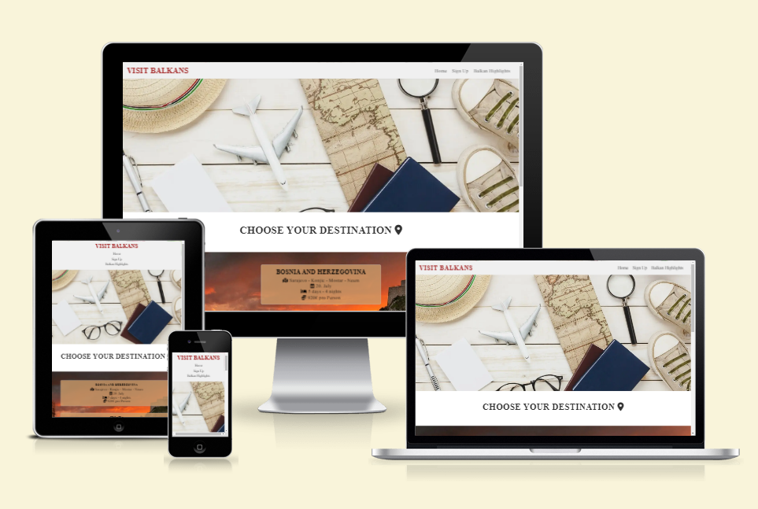
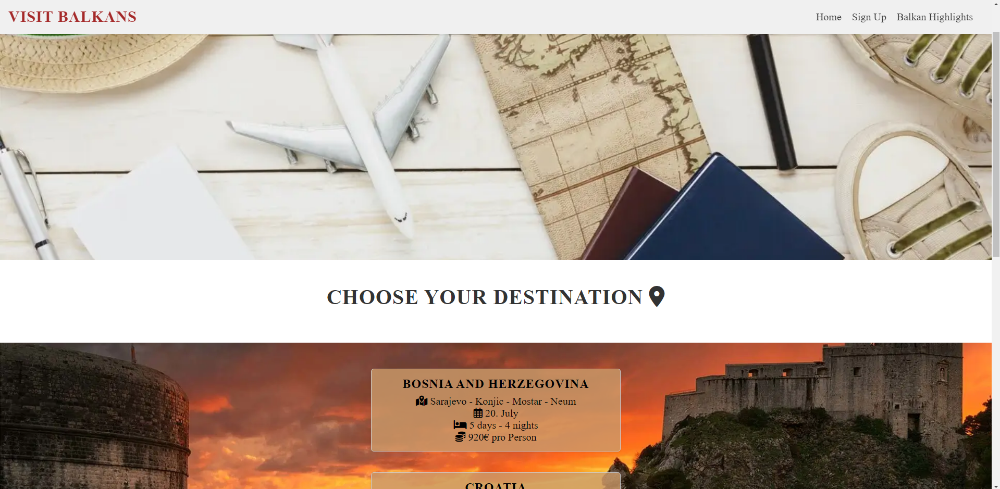
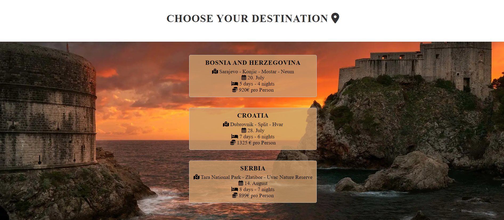
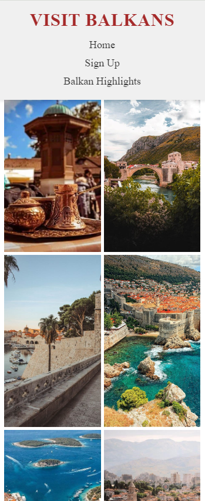
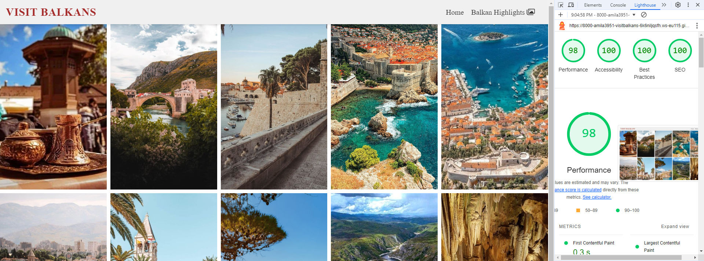

# VISIT BALKANS
Embark on an unforgettable journey through the heart of Europe with "Visit Balkans"! Explore a captivating blend of rich history, diverse cultures, stunning landscapes, and warm hospitality.

### Discover hidden gems: 
Uncover ancient ruins, charming medieval towns, and vibrant cities brimming with life. Immerse yourself in the unique traditions and customs of each Balkan country, from Croatia's stunning coastline to the mountainous beauty of Serbia and Bosnia's captivating cultural heritage.

### Food
Indulge your taste buds: Savor the flavors of the Balkans with its delicious cuisine, a fusion of Mediterranean, Turkish, and Slavic influences. Feast on hearty grilled meats, fresh seafood, savory pastries, and flavorful local wines.

### Adventure awaits:  
Whether you're seeking outdoor thrills or tranquil escapes, the Balkans have it all. Hike through pristine national parks, relax on idyllic beaches, ski down snowy slopes, or explore picturesque river valleys.

### Experience warm hospitality: 
The Balkans are renowned for their welcoming locals who are eager to share their traditions and stories. Engage with friendly villagers, learn about their crafts, and create lasting memories.

### Off - the - beaten - path wonders: 
Escape the crowds and discover the Balkans' hidden treasures. Wander through picturesque villages, explore ancient monasteries, and soak in the natural beauty of unspoiled landscapes.

**Your Balkan adventure starts here!  Let "Visit Balkans" be your guide to this enchanting region, where history, culture, and nature intertwine to create an unforgettable travel experience. Start planning your dream Balkan trip today!**

## User goals
Visit Balkans is for all adventurous travelers seeking unique experiences, history and culture enthusiasts, foodies, nature lovers, budget - conscious explorers, and those who crave authentic, off - the - beaten - path adventures.

- **Experience cultural diversity**: Explore the unique cultures, traditions, and customs of different Balkan countries.
- **Discover historical sites**: Visit ancient ruins, medieval towns, and other historical landmarks.
- **Enjoy natural beauty**: Hike through scenic mountains, relax on picturesque beaches, or explore national parks.
- **Taste local cuisine**: Sample the delicious food and drinks of the region, from hearty stews to fresh seafood.
- **Meet friendly locals**: Interact with welcoming people and learn about their way of life.
- **Have an affordable vacation**: Find budget - friendly accommodations, transportation, and activities.
- **Travel off the beaten path**: Discover hidden gems and less touristy destinations.
- **Experience adventure and outdoor activities**: Go hiking, rafting, kayaking, or participate in other adventure sports.
- **History buffs**: Explore ancient ruins, medieval castles, and Ottoman - era architecture. Visit historical museums and learn about the region's complex past.
- **Foodies**: Sample traditional Balkan dishes, attend food festivals, and take cooking classes. Visit local markets and wineries.
- **Nature lovers**: Hike in the Alps, explore Plitvice Lakes National Park, or relax on the Adriatic coast. Visit waterfalls, caves, and other natural wonders.
- **Adventure seekers**: Go rafting on the Tara River, try paragliding, rock climbing, or other adventure sports.
- **Learn about the region's recent history**: Understand the events of the 1990s and their impact on the region.
- **Learn a new language**: Practice speaking the local language (e.g., Croatian, Serbian, Albanian) or learn basic phrases.
- **Relax and rejuvenate**: Enjoy the slower pace of life in the Balkans and disconnect from the stresses of everyday life.

## Features
- **Am I responsive**
  - Visit Balkans is fully responsive and optimized for a seamless browsing experience on all devices, from smartphones to tablets to desktops.

### First page / Home page
This is the homepage for a travel website called "Visit Balkans." It aims to promote tourism in the Balkan region, specifically Bosnia and Herzegovina, Croatia, and Serbia.

## Layout and Content
### Header
The header features a sleek navigation menu with links to "Home", "Sign Up" and "Balkan Highlights". Upon hovering over each link, a subtle underline effect gracefully appears, enhancing the user experience and guiding them towards their desired section of the website.
- A title ("Visit Balkans") that links back to the homepage.
- A navigation menu with links to:
  - **Home**: The current page.
  - **Sign Up**: The "Sign Up" link in the navigation menu is designed to take the user to the Sign up section within the same webpage. When clicked, it will automatically scroll the page down to the section where the Sign up form is located, allowing the user to quickly access and complete the form without having to manually scroll through the page.
  - **Balkan Highlights**: The "Balkan Highlights" link in the navigation menu is a hyperlink that, when clicked, will take the user to a new webpage called "gallery.html". This page is expected to contain a collection of images showcasing the beauty and diversity of the Balkan region.

The header, featuring the logo and navigation menu, remains fixed at the top of the screen throughout the user's scrolling journey, ensuring easy access and navigation. This design choice is inspired by the Love Running project's emphasis on user - friendly interfaces and intuitive navigation.

**Responsive Header:**
On smaller screens (typically below 768px width), the header layout changes to a vertical arrangement. This ensures better usability on devices with limited screen space. The elements within the header (title, "Home", "Sign Up" and "Balkan Highlights") will stack in a single column, one below the other.

### Main Content
- **Travel Section (Image)**: This section likely features a large background image showcasing the essence of travel, with visuals of passports, airplanes, maps, and other iconic symbols that evoke the spirit of adventure and exploration.

- **Destinations Section**
  - A heading ("Choose Your Destination") with a location icon.
  - Three featured tour packages: 
Each package showcases a captivating Balkan destination (Bosnia and Herzegovina, Croatia, or Serbia), offering a glimpse into a carefully curated itinerary with highlights of key locations, travel dates, duration, and cost per person. 
  - Engage with the tours through an interactive hover effect, where each package subtly expands upon mouseover, inviting you to delve deeper into the details of your dream Balkan adventure.

- **Sign Up Section**:
  - Heading: An engaging headline encourages users to stay informed about the latest Balkan adventures, special offers, and travel tips.
  - Sign Up Form: A user - friendly form includes fields for:
     - Email Address: This field prompts users to enter their email address and offers autofill suggestions based on previously saved email addresses in their browser. It also includes validation to ensure the email format is correct (i.e., contains "@"). If an invalid email is entered, an error message (e.g., "Please enter a valid email address") is displayed below the field.
     - Password: This field requests users to create a password for their account. If left empty, an error message (e.g., "Please enter a password") appears below the field.
     - "Sign Up" Button: A visually prominent button enables users to submit the form. Upon clicking, if any required fields are not filled in correctly, an overall error message (e.g., "Please fill in all required fields") is displayed at the top of the form, and the relevant field - specific error messages are shown.

- **Footer**: Social media icons linking to the website's pages on Facebook, Instagram, Twitter, and YouTube. (Inspired by the Love Running project.)

## Balkan Highlights
This page showcases the stunning beauty and diversity of the Balkan region through a curated collection of photographs captured in Bosnia and Herzegovina, Croatia, and Serbia.

- **Navigation Bar**:
  - The navigation bar prominently displays the page title ("Visit Balkans").
  - A "Home" link allows seamless return to the main website, where users can find the "Sign Up" option for subscribing to updates and offers.
  - The navigation bar is fixed at the top of the screen for easy access while scrolling. (Inspired by Love Running Project).

  

- **Responsive Design**:
  - On larger screens (desktops/tablets), the image gallery is presented in two rows of five images each.

   

  - On smaller screens (mobile devices), the gallery adapts to a vertical layout with five rows of two images each.

      

- **Interactive Hover Effect**:
Hovering over an image triggers a subtle scaling effect, making the image slightly larger and creating a visual cue for interactivity.

- **Footer**:
The footer includes links to the website's social media profiles, encouraging engagement and community building.

### **How to Use**
1. Access the "Balkan Highlights" page from the main website's navigation menu.
2. Explore the gallery by scrolling through the images.
3. Hover over images to reveal a subtle enlargement effect.
4. Click on social media icons in the footer to connect with the "Visit Balkans" community.
5. Use the "Home" link in the navigation bar to return to the main website, where you can find the "Sign Up" option to subscribe to updates and offers.

## Major Bugs & Fixes
1. **Images**
   - **Initial Lighthouse Performance Score**: 52 (Poor)
   - **Issue**: Large image sizes were significantly impacting page load times.
   - **Solution**: Image optimization was performed using ShortPixel and TinyPNG to reduce file sizes without sacrificing visual quality. This resulted in a substantial improvement in the Lighthouse performance score.

## Validation
Through the use of various tools and validators, a well - designed site that meets all web standards has been achieved.

### Lighthouse
The site has successfully met the performance, accessibility, best practices, and SEO criteria set by Lighthouse.

- **Home page**: Achieved perfect scores (100) across all categories: Performance, Accessibility, Best Practices, and SEO.

- **Balkan Highlights page**: Also achieved perfect scores (100) in Accessibility, Best Practices, and SEO, with a near - perfect Performance score of 98.

### HTML Validation
- The HTML code was validated to ensure compliance with web standards
- Both index.html and gallery.html have been validated using an HTML validator and are free of errors, ensuring clean and standards - compliant code.

### CSS Validation
- CSS code was validated to ensure compliance with web standards.
- No errors or warnings.

## Technology used
- **HTML**: Structure of the web pages.
- **CSS**: Styling of the web pages, including responsive design for various screen sizes.
- **Favicon**: Globe icon for the website.
- **Image Optimization**: To enhance loading speed and overall user experience, images on this website have been optimized using image compression techniques. This reduces file sizes without significantly compromising visual quality.
- **HTML Validator**: A tool used to check the HTML code for errors, ensuring it adheres to web standards and best practices. This helps maintain cross - browser compatibility and accessibility.
- **CSS Validator**: A tool that analyzes the CSS code for syntax errors and potential issues. It ensures your styles are valid and optimized, contributing to a smooth user experience across different browsers.

## Deployment
- The site was deployed using GitHub Pages.
- The repository can be found at: https://github.com/Amila3951/Visit-Balkans.git
- The deployed site can be found at: https://8000-amila3951-visitbalkans-6k6niljqsfh.ws-eu115.gitpod.io/index.html

### GitHub Deployment
1. Login or Sign Up to GitHub.
2. Open the project repository.
3. Navigate to "Settings" on the navigation bar under the repository title.
4. Click on "Pages" in the left - hand navigation panel.
5. Under "Source", choose which branch to deploy (Main or Master).
6. Choose which folder to deploy from, usually "/root".
7. Click "Save", then wait for the page to be deployed.
8. The URL is displayed above "Source".

### Meta Information
- **Description**: "Plan your dream Balkan vacation today! Discover unique destinations, off - the - beaten - path adventures, and affordable travel options. Visit Balkans - your gateway to the heart of Europe."
- **Keywords**: "travel, travel agency, travel page, Balkans, Bosnia and Herzegovina, Croatia, Serbia, visit Balkans, vacation, trip, visit Balkan, Balkan travel, Balkan tour, Balkan trip, Balkan vacation, Balkan holiday, Balkan adventure, Balkan destinations, Balkan countries, Balkan tourism, things to do in the Balkans"

### Favicon
- [Favicon](https://www.flaticon.com/search?word=globe)

#### Images
- [iStock](https://www.istockphoto.com/de)
- [Freepic](https://www.freepik.com/)
- [Pinterest](https://www.pinterest.com/)

**Image Optimization**:
- [Short Pixel](https://shortpixel.com/)
- [TinyPNG](https://tinypng.com/)

## Credits
- The fixed header and social media footer design were inspired by the **Love Running Project**.